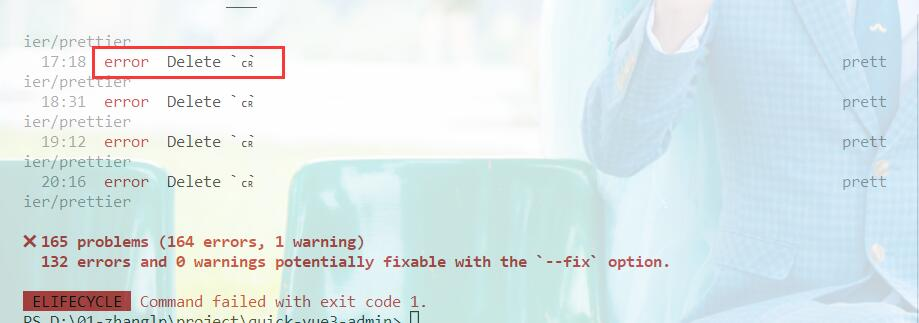

# 安装依赖包

## nodejs

### 介绍

JavaScript 运行环境
nodejs 是能够在服务器端运行 JavaScript 的开放源代码、跨平台运行环境
Node.js 是一个基于 Chrome V8 引擎的 JavaScript 运行环境。Node.js 使用了一个事件驱动、非阻塞式 I/O 的模型,使其轻量又高效。Node.js 的包管理器 pnpm,是全球最大的开源库生态系统。

### 下载

下载地址：http://nodejs.cn/download/

### 安装

安装分为普通安装和包管理器方式安装。

#### 普通安装

一直下一步

#### 包管理器安装

通过包管理器安装 Node.js

安装参考：

http://nodejs.cn/download/package-manager/

使用如下命令测试 nodejs 是否安装成功

```sh
node -v
pnpm -v
```

nodejs 默认包含 npm，如果需要更新 pnpm 版本使用如下命令

```sh
pnpm install -g pnpm
```

由于本教程使用 pnpm 管理依赖包，故此需要安装 pnpm

```sh
pnpm install pnpm -g

pnpm -v
```

### 常用包管理器

npm、yarn、pnmp(推荐)

### 配置

## vite

### 介绍

官网地址：

https://vitejs.cn/guide/

vite 是一种新型前端构建工具，模块热更新和 rollup 构建指令

特点：（优点）

1.服务器启动特别快；（极速启动）

2.轻量快速热重载；（HMR 模块热重载）

3.支持 TS、jsx，css 等；

### 安装

::: tip 注意
Vite 需要 Node.js 版本 >= 12.0.0。
:::

安装命令：

```sh
pnpm create vite
```

还可以指定模板

```sh
pnpm create vite my-vue-app -- --template vue
```

安装依赖包及运行

```sh
cd my-vue-app

pnpm install

pnpm run dev

```

::: tip 注意
此处使用的是 vite2，需要其他 vite 版本，[请在这里查看](https://vitejs.cn/guide/)。
:::

### vite 环境变量配置

::: tip 注意
无论什么环境都会加载.env 文件，同名变量会被开发环境或生产环境覆盖，此配置文件优先级最低。

开发环境默认会自动加载.env.development 文件，不需要特殊处理。

生产环境默认会自动加载.env.production 文件，不需要特殊处理。

-- mode 只有自定义环境时，才需要在 package.json 配置，具体阅读下面的[测试环境](http://localhost:3000/guide/install.html#%E6%B5%8B%E8%AF%95%E7%8E%AF%E5%A2%83)即可。
:::

#### 任何环境都会加载

在项目根目录下创建.env 文件，配置：

```sh
# env

VITE_APP_BASE_URL='/'
```

#### 开发环境

在项目根目录下创建.env.development 文件，配置：

```sh
# development

VITE_APP_BASE_URL=http://localhost:8080
```

#### 生成环境

在项目根目录下创建.env.production 文件，配置：

```sh
# production

VITE_APP_BASE_URL=http://192.168.0.1:8080
```

#### 测试环境

在项目根目录下创建.env.staging 文件，配置：

```sh
# staging

VITE_APP_BASE_URL=http://192.168.0.2:3000
```

由于测试环境是自定义环境，故此需要如下配置

```json
// package.json
 "scripts": {
   ...
    "build:staging": "vue-tsc --noEmit && vite build --mode staging",
   ...
```

#### 使用环境变量

```ts
const baseURL = import.meta.env.VITE_APP_BASE_URL
console.log('baseURL:', baseURL)
```

### 常见错误

#### 错误：

::: danger 错误信息
ERR_PNPM_INVALID_OVERRIDE_SELECTOR  Cannot parse the "//" selector in the overrides
:::
解决方案 1：
把 package.json 文件中 含有 "//" 的行删除即可

```json
  "resolutions": {
     "//": "Used to install imagemin dependencies, because imagemin may not be installed in China. If it is abroad, you can delete it",
    "bin-wrapper": "pnpm:bin-wrapper-china",
    "rollup": "^2.56.3"
  },
```

解决方案 2：
pnpm 降级到 6.23.6（没试，不想降级）

这里是搭建项目遇到的错误，整理分享给大家。

#### 错误 1：

::: danger 错误信息
Network: use `--host` to expose
:::

解决方案：

```ts
//vite.config.ts 配置 server 节点
export default defineConfig({
  plugins: [vue()],
  server: {
    host: '0.0.0.0',
  },
})
```

#### 错误 2：

::: danger 错误信息
pnpm run build 报错 Cannot access ambient const enums when the '--isolatedModules' flag is provided
:::

解决方案：

tsconfig.json 中 isolatedModules 设置为 false 不推荐，暂时使用此方式，后期研究官方参数

#### 错误 3：

::: danger 错误信息
warning package.json: No license field
$ vue-tsc --noEmit && vite build
:::

解决方案：
package.json 中配置如下两个参数

```json
"license": "ISC",
"private": true,
```

#### 错误 4：

::: danger 错误信息
vite 无法使用 require,require is not defined
:::

解决方案：

```sh
pnpm install @types/node --save-dev
```

### vite.config.ts 完整配置

```ts
import { defineConfig } from 'vite'
import vue from '@vitejs/plugin-vue'

const path = require('path')

// https://vitejs.dev/config/
export default defineConfig({
  plugins: [vue()],
  resolve: {
    alias: [
      {
        find: '@',
        replacement: path.resolve(__dirname, 'src'),
      },
      {
        find: 'vue-i18n',
        replacement: 'vue-i18n/dist/vue-i18n.cjs.js',
      },
    ],
  },
})
```

## vue-router

### 介绍

vue-router 是 vue 路由。

官网地址：https://router.vuejs.org/zh/

### 安装

安装命令

```sh
pnpm install vue-router@4 --save
```

::: warning 注意
vue3 要求使用 vue-router 版本 4+
:::

### 配置

1.在 src 下创建 router 文件夹

2.在 router 文件夹下创建 index.ts 文件

#### 配置路由

```ts
// index.ts

import { createRouter, createWebHashHistory } from 'vue-router'
import layout from '../layout/index.vue'

const router = createRouter({
  history: createWebHashHistory(),
  routes: [
    {
      path: '/',
      component: layout,
      redirect: '/home',
      children: [
        {
          path: '/home',
          component: () => import('../views/home/index.vue'),
        },
      ],
    },
  ],
})
export default router
```

#### main.ts 中导入

```ts
...

import router from './router'
app.use(router)
...
```

## vuex

### 介绍

状态管理，推荐使用 pinia

vuex 官网地址：https://vuex.vuejs.org/zh/

### 安装

安装命令

```sh
pnpm install vuex@4 --save
```

### 配置

1.在 src 下创建 store 文件夹

2.在 store 文件夹下创建 index.ts 文件

#### 配置状态管理器

###### 非模块化配置

::: tip
如果项目比较小，可以将 state.ts、mutations.ts、actions.ts、getters.ts 等文件合并为一个 app.ts
:::

```ts
// state.ts -> app.ts下的state.ts
export interface State {
  language: string
}

const state = {
  language: 'zh',
}

export default state

// mutations.ts -> app.ts下的mutations.ts
import { State } from './state'

const mutations = {
  SET_LANGUAGE: (state: State, language: string) => {
    state.language = language
  },
}

export default mutations

// actions.ts -> app.ts下的actions.ts
const actions = {}

export default actions

//getters.ts -> app.ts下的getters.ts
import { State } from './state'

const getters = {
  language: (state: State) => state.language,
  //sum: (state: State) => {//如果值需要处理，使用此方式
  //  return state.num * 5
  //},
}

export default getters
```

```ts
// index.ts
import { InjectionKey } from 'vue'
import { useStore as baseUseStore, createStore, Store } from 'vuex'
import state, { State } from './state'
import actions from './actions'
import mutations from './mutations'
import getters from './getters'

export const key: InjectionKey<Store<State>> = Symbol('key')

export const useStore = () => {
  return baseUseStore(key)
}

const store = createStore({
  // strict: true,//TODO:开启严格模式，必须在mutation函数中去变更值，否则报错。
  strict: process.env.NODE_ENV !== 'production', // 生成环境下关闭严格模式，避免影响性能
  state,
  actions,
  mutations,
  getters,
})

export default store
```

##### 模块化配置及自动导入模块

1.创建模块化文件夹 modules

2.创建用户模块 user.ts

```ts
// user.ts
export interface UserState {
  token: string
}
const userState = {
  token: '',
}

const mutations = {
  SET_TOKEN: (state: UserState, token: string) => {
    state.token = token
  },
}

const actions = {}

export default {
  namespace: true,
  state: userState,
  mutations,
  actions,
}
```

```ts
// index.ts
import { InjectionKey } from 'vue'
import { useStore as baseUseStore, createStore, Store } from 'vuex'
import state, { State } from './state'
import actions from './actions'
import mutations from './mutations'
import getters from './getters'

// 自动导入modules
let modules = {}
const modulesFiles = import.meta.globEager('./modules/*.ts')
Object.keys(modulesFiles).forEach((element) => {
  const moduleName = element.replace(/(.*\/)*([^.]+).*/gi, '$2')
  const value = modulesFiles[element]
  modules = { ...modules, [moduleName]: value.default }
})

export const key: InjectionKey<Store<State>> = Symbol('key')

export const useStore = () => {
  return baseUseStore(key)
}

const store = createStore({
  // strict: true,//TODO:开启严格模式，必须在mutation函数中去变更值，否则报错。
  strict: process.env.NODE_ENV !== 'production', // 生成环境下关闭严格模式，避免影响性能
  state,
  actions,
  mutations,
  getters,
  modules,
})

export default store
```

#### main.ts 中导入

```ts
...
import store, { key } from './store'
app.use(store, key)
...
```

## pinia

### 介绍

状态管理器等同于 vuex，推荐使用 pinia。

官网地址：https://pinia.vuejs.org/

### 安装

```sh
pnpm install pinia
```

### 配置

1.在 src 目录下创建 store 目录；

2.在 store 目录下创建 index.ts 文件

3.配置 index.ts

```ts
// index.ts
import { createPinia } from 'pinia'

const pinia = createPinia()
export { pinia }
```

4.main.js 中配置

```ts
// main.ts
...
import {pinia} from "./store";
app.use(pinia);
...
```

### 定义

```ts
// modeuls/user.ts
import { defineStore } from 'pinia'

interface UserState {
  token: string
}

export const useUserStore = defineStore('userStore', {
  state: (): UserState => {
    return {
      token: '',
    }
  },
  getters: {
    loginToken(): string {
      return this.token
    },
  },
  actions: {
    setToken(token: string) {
      this.token = token
    },
  },
})
```

### 使用

1. option API

```vue
<script lang="ts">
import { defineComponent } from 'vue'
import { mapState } from 'pinia'
import { useUserStore } from '../../store/modules/user'

export default defineComponent({
  setup() {
    const userStore = useUserStore()
    userStore.setToken('1111')
  },
  computed: {
    ...mapState(useUserStore, ['loginToken']),
  },
})
</script>
<template>
  <div>用户列表</div>
  <div>token：{{ loginToken }}</div>
</template>
<style></style>
```

2. composition API (setup)

```vue
<script lang="ts">
import { defineComponent } from 'vue'
import { useUserStore } from '../../store/modules/user'

export default defineComponent({
  setup() {
    const userStore = useUserStore()
    userStore.setToken('1111')
    const loginToken = userStore.loginToken
    return {
      userStore,
      loginToken,
    }
  },
})
</script>
<template>
  <div>用户列表</div>
  <div>token：{{ loginToken }}</div>
</template>
<style></style>
```

3. composition API(语法糖)

```vue
<script setup lang="ts">
import { computed } from 'vue'
import { useUserStore } from '../../store/modules/user'

const userStore = useUserStore()
userStore.setToken('1111')
const loginToken = computed(() => userStore.loginToken)
</script>
<template>
  <div>用户列表</div>
  <div>token：{{ loginToken }}</div>
</template>
<style></style>
```

### 持久化

1.安装

```
pnpm install pinia-plugin-persist
```

2.导入

```ts
import { createPinia } from 'pinia'
import persist from 'pinia-plugin-persist'

const pinia = createPinia()
pinia.use(persist)
export { pinia }
```

3.配置使用

```ts
import { defineStore } from 'pinia'

interface UserState {
  token: string
}

export const useUserStore = defineStore('userStore', {
  state: (): UserState => {
    return {
      token: '',
    }
  },
  getters: {
    getToken(): string {
      return this.token
    },
  },
  actions: {
    setToken(token: string) {
      this.token = token
    },
  },
  //核心配置
  persist: {
    enabled: true, //启用
    strategies: [
      {
        key: 'user', //存储的key
        storage: localStorage, //存储方式sessionStorage|localStorage//默认sessionStorage
        paths: ['token'], //要存储的属性
      },
    ],
  },
})
```

4.自定义存储方式

```ts
const cookiesStorage: Storage = {
  setItem(key, state) {
    return Cookies.set('accessToken', state.accessToken, { expires: 3 })
  },
  getItem(key) {
    return JSON.stringify({
      accessToken: Cookies.getJSON('accessToken'),
    })
  },
}
import { defineStore } from 'pinia'

interface UserState {
  accessToken: string
}

export const useUserStore = defineStore('userStore', {
  state: (): UserState => {
    return {
      accessToken: '',
    }
  },
  getters: {
    getToken(): string {
      return this.accessToken
    },
  },
  actions: {
    setToken(accessToken: string) {
      this.accessToken = accessToken
    },
  },
  //核心配置
  persist: {
    enabled: true, //启用
    strategies: [
      {
        key: 'user', //存储的key
        storage: cookiesStorage, //自定义
        paths: ['accessToken'], //要存储的属性
      },
    ],
  },
})
```

5.效果


::: warning 警告

1.只配置 enabled 为 true 默认会以模块 id 为 key，存储当前模块所有的状态；

2.路由跳转会刷新掉 store，尽量放在路由刷新后存储。
:::

## element-plus

### 介绍

基于 Vue 3，面向设计师和开发者的组件库，官网地址：https://element-plus.gitee.io/zh-CN/

### 安装

安装命令

```sh
pnpm install element-plus --save
```

### 完整引入

如果你对打包后的文件大小不是很在乎，那么使用完整导入会更方便。

```ts
...
// main.ts
import ElementPlus from 'element-plus'
import 'element-plus/dist/index.css'
app.use(ElementPlus)
...
```

volar 配置

如果您使用 Volar，请在 tsconfig.json 中通过 compilerOptions.type 指定全局组件类型。

```ts
// tsconfig.json
{
  "compilerOptions": {
    // ...
    "types": ["element-plus/global"]
  }
}
```

### 按需导入

参考官网：https://element-plus.gitee.io/zh-CN/guide/quickstart.html#%E6%8C%89%E9%9C%80%E5%AF%BC%E5%85%A5

## i18n

### 介绍

Vue I18n 是 Vue.js 的国际化插件。它可以轻松地将一些本地化功能集成到你的 Vue.js 应用程序中。

官网地址：https://kazupon.github.io/vue-i18n/zh/

### 安装

```sh
pnpm install vue-i18n
```

### 配置

1.在 src 目录下创建 i18n 目录

2.在 i18n 目录下创建 index.ts 文件和 lang 目录

3.在 lang 目录下创建 en.json 和 zh.json，文件内容如下：

```json
// en.json
{
  "title": "aini team"
}
```

```json
// zh.json
{
  "title": "艾尼科技"
}
```

3.index 的配置如下

```ts
// index.ts
import { createI18n } from 'vue-i18n'
import { pinia } from '../store'
import { useAppStore } from '../store/modules/app'

import zhLocale from './lang/zh.json'
import enLocale from './lang/en.json'

const messages = {
  zh: zhLocale,
  en: enLocale,
}
const appStore = useAppStore(pinia)

const i18n = createI18n({
  locale: appStore.getLanguage,
  messages,
  globalInjection: true, //解决Uncaught (in promise) TypeError: _ctx.$t is not a function
  allowComposition: true, // 使用新特性 例如：useI18n
  legacy: false, // 使用组合式api
})

export default i18n
```

### 常见错误

#### 错误：

::: danger 错误信息
Uncaught (in promise) TypeError: \_ctx.$t is not a function
:::

解决方案 1：

```ts
const i18n = createI18n({
  ...
   globalInjection: true,//增加此属性
   ...
})
```

解决方案 2：
升级 vue-i18n 到 9.2.0-beta.35

## axios

### 介绍

官网：

Axios 是一个基于 promise 的 HTTP 库，可以用在浏览器和 node.js 中。
axios 本质上也是对原生 XHR 的封装，只不过它是 Promise 的实现版本，符合最新的 ES 规范。
axios 时目前最流行的 ajax 封装库之一，用于很方便地实现 ajax 请求的发送。

### 安装

```sh
pnpm install axios
```

### 封装 axios 拦截器

1.在 utils 目录下创建 request.ts，配置如下：

```ts
// request.ts
import axios, { AxiosInstance, AxiosRequestConfig, AxiosResponse } from 'axios'

const baseURL = import.meta.env.VITE_APP_BASE_URL
const request: AxiosInstance = axios.create({
  baseURL: baseURL,
  timeout: 1000 * 15,
  headers: {
    'Content-Type': 'application/json;charset=utf-8',
  },
})

// 请求拦截器
request.interceptors.request.use(
  (config: AxiosRequestConfig) => {
    //   const token = ''
    //   config.headers.token = `Bearer ${token}`
    return config
  },
  (error) => {
    console.error(error)
    return Promise.reject(error)
  }
)

// 响应拦截器
request.interceptors.response.use(
  (res: AxiosResponse) => {
    const { data } = res
    const { code, data: payload, msg } = data
    if (code === '200') {
      return Promise.resolve(payload)
    }
    return Promise.reject(msg)
  },
  (error) => {
    console.error(error)
    return Promise.reject(error)
  }
)

export default request
```

### 使用

```ts
import request from '@/utils/request'

request({
    url: "/api/user/getUserList",
    method: "GET",
    ...
  });
```

## mock

### 介绍

官网地址：http://mockjs.com/examples.html

1.mock 是模拟数据，方便前端和后端交互，提高工作效率。在接口未开发或者未完成时，前后端只需要规范接口的规则，前端通过接口规则去生成模拟数据。这样前端就不需要等待后端，此时可以使用 mock 来模拟后端数据完成前端的逻辑，待后端接口提供后再切换到真实接口即可。

2.后端还可以用做单元测试

### 方案

方案一：变量

```ts
const data = [
  {
    id: 1,
    name: '张三',
  },
]
console.log(data)
```

方案二：文件（json、ts、js 等）

下面使用 json 文件举例

1.创建 json 文件及定义 json

```json
// list.json
{
  "list": [
    {
      "id": 1,
      "name": "张三"
    }
  ]
}
```

2.导入 json 文件使用

```ts
import json from '路径/list.json'
console.log('data', json)
```

方案三：本地 mock（不推荐，由于会写很多与项目无关的 mock 代码）

方式是使用拦截请求

方案四：mock 服务（当下推荐的方式）

1.使用 apipost 工具提供的 mock 服务

官网文档地址：https://wiki.apipost.cn/document/00091641-1e36-490d-9caf-3e47cd38bcde/832f6d9f-7951-4361-b959-229666685ba9

下图是我自己使用的 apipost 工具 mock 配置截图


2.其他工具提供的 mock 服务；

3.自己搭建 mock 服务；

## husky

### 介绍

git 提交时校验 eslint 的方案之一

### 安装 husky

```sh
pnpm install husky --save-dev
```

### 安装配置文件

```sh
npx husky install
npm set-script prepare "husky install"
npx husky add .husky/pre-commit "npm test"
```

### 配置

修改 pre-commit 文件

```
#!/bin/sh
. "$(dirname "$0")/_/husky.sh"

npm test //--
pnpm run lint-fix //++
git add //++

```

## 流水线

### 介绍

流水线是 CICD 工具，可提供持续集成、持续交付（部署）能力，帮助企业不断提升应用交付的质量和效率。通过构建自动化、测试自动化、部署自动化，完成从代码提交到应用交付的自动化。通过交付流程度量，发现效率问题，并推荐优化方案。

### 方案

1.码云提供的 Gitee Go；

2.阿里云-云效 Codeup

3.百度效率云

4.华为开源平台

5.码市；

6.coding；

### 配置

1. 阿里云-云效 Codeup

2. 码云的 gitee go 配置文件

gitee 流水线中增加流水线及配置流水线，配置完后产生的配置文件如下：

```yml
// .workflow/master-pipeline.yml
version: '1.0'
name: master-line
displayName: master分支流水线
triggers:
  trigger: auto
  push:
    branches:
      precise:
        - master
stages:
  - name: stage-afddc16e
    displayName: 构建
    strategy: naturally
    trigger: auto
    executor: []
    steps:
      - step: build@nodejs
        name: build_nodejs
        displayName: Nodejs 构建
        nodeVersion: 14.16.0
        commands:
          - npm install && rm -rf ./dist && npm run build
        artifacts:
          - name: BUILD_ARTIFACT
            path:
              - ./dist
      - step: publish@general_artifacts
        name: publish_general_artifacts
        displayName: 上传制品
        dependArtifact: BUILD_ARTIFACT
        artifactName: output
        dependsOn: build_nodejs
  - name: stage-cb94206a
    displayName: 发布
    strategy: naturally
    trigger: auto
    executor: []
    steps:
      - step: publish@release_artifacts
        name: publish_release_artifacts
        displayName: 发布
        dependArtifact: output
        version: 1.0.0.0
        autoIncrement: true
  - name: stage-dd45b99f
    displayName: 部署
    strategy: naturally
    trigger: auto
    executor: []
    steps:
      - step: deploy@agent
        name: deploy_agent
        displayName: 主机部署
        hostGroupID: 部署服务器1
        deployArtifact:
          - source: build
            name: output
            target: /www/wwwroot/quick.com/gitee_go/deploy
            dependArtifact: BUILD_ARTIFACT
        script: |-
          # 请在此输入部署脚本或者需要执行的部署脚本文件

          # 压缩方式备份部署目录到backup目录下
          cd /www/wwwroot/quick.com/dist
          tar -zcvf /www/wwwroot/quick.com/backup/dist.tar.gz /www/wwwroot/quick.com/dist
          # 备份后删除部署目录
          rm -rf /www/wwwroot/quick.com/dist
          # 解压部署包到部署目录下
          tar -zxvf /www/wwwroot/quick.com/gitee_go/deploy/output.tar.gz -C /www/wwwroot/quick.com
          echo "Finish"
permissions:
  - role: admin
    members: []


```

### tar 压缩和解压

1. 压缩：

语法

```
tar -zcvf 目标目录/压缩后的文件名称.tar.gz 源目录
```

例子

```
tar -zcvf /www/wwwroot/quick.com/backup/dist.tar.gz /www/wwwroot/quick.com/dist
```

2. 解压：

语法

```
tar -zxvf 源目录/output.tar.gz -C 目标目录
```

例子

```
tar -zxvf /www/wwwroot/quick.com/gitee_go/deploy/output.tar.gz -C /www/wwwroot/quick.com
```

3. tar 命令的常用参数

```
-c, --create 创建一个新归档
-x, --extract, --get 从归档中解出文件
-f, --file=ARCHIVE 使用归档文件
-z, 是否需要用gzip压缩
-C, --directory=DIR 改变至目录 DIR
-v, 压缩的过程中显示档案
```

3.其他方案的配置参考各个平台提供的教程

## webhooks

### 介绍

1.反向 api 2.回调 3.推送； 4.订阅； 5.事件触发；

### 安装

### 配置

## volar

volar 插件改名为 Vue Language Features (Volar)

vscode 插件市场安装 volar 即可

## eslint

### 介绍

eslint 是代码规范

### 安装

1.安装 eslint

```sh
pnpm install eslint --save-dev
```

::: tip 注意
eslint 只有开发阶段需要，因此添加到开发阶段的依赖中即可
:::

2.配置 eslint

在项目的根目录下创建.eslintrc.js 的 eslint 配置文件

```js
// .eslintrc.js
module.exports = {
  root: true,
  env: {
    browser: true, // browser global variables
    es2021: true, // adds all ECMAScript 2021 globals and automatically sets the ecmaVersion parser option to 12.
  },
  parserOptions: {
    ecmaVersion: 12,
  },
}
```

3.安装 vue 的 eslint 插件

```sh
pnpm install eslint-plugin-vue --save-dev
```

4.配置 vue 的 eslint 插件

```js
// .eslintrc.js
...
extends: [
    'plugin:vue/vue3-recommended' // ++
]
...
```

5.安装 Airbnb 基础规则的 eslint 插件

```sh
// npm version > 5
npx install-peerdeps --dev eslint-config-airbnb-base

pnpm install eslint-config-airbnb-base eslint-plugin-import --save-dev
```

4.配置 Airbnb 基础规则的 eslint 插件

```js
// .eslintrc.js
...
extends: [
    'plugin:vue/vue3-recommended',
    'airbnb-base', // ++
],
...
```

5.安装 prettier 风格插件
本次项目不单独引入 prettier，而是使用 eslint 插件将 prettier 作为 eslint 规则执行。

```sh
pnpm install --save-dev eslint-plugin-prettier
pnpm install --save-dev --save-exact prettier
```

6.配置 prettier 风格插件

```js
// .eslintrc.js
...
plugins: ['prettier'], // ++
rules: {
    'prettier/prettier': 'error', // ++
},
...
```

::: warning 警告
配置到此时，就会遇到 eslint 规则和 prettier 规则冲突的情况。

eslint 告诉我们要使用单引号，但是改为单引号以后，prettier 又告诉我们要使用双引号。

这时候就需要另一个 eslint 的插件 eslint-config-prettier，这个插件的作用是禁用所有与格式相关的 eslint 规则，也就是说把所有格式相关的校验都交给 prettier 处理。

为了解决 eslint 和 prettier 冲突，安装下面插件即可。
:::

7.安装禁用 eslint 风格规则的 eslint-config-prettier 插件

```sh
pnpm install --save-dev eslint-config-prettier
```

8.配置禁用 eslint 风格规则的 eslint-config-prettier 插件

```js
// .eslintrc.js
...
plugins: ['prettier'],
extends: [
    'plugin:vue/vue3-recommended',
    'airbnb-base',
    'plugin:prettier/recommended', // ++
],
rules: {
    'prettier/prettier': 'error',
},
...
```

9.自定义 prettier 的规则

在项目的根目录下创建.prettierrc.js 的 prettier 配置文件

```js
// .prettierrc.js
module.exports = {
  ...
  semi: false, //句末是否有分号
  singleQuote: true, //是否使用单引号
  arrowParens: 'avoid',//箭头函数一个参数时省略函数圆括号
  endOfLine: 'auto',
  ...
}
```

10.配置 eslint 检测 ts 文件（非 typscript 不需要配置此项即可）

::: tip 注意
由于性能问题，TypeScript 官方决定全面采用 ESLint，甚至把仓库（Repository）作为测试平台，而 ESLint 的 TypeScript 解析器也成为独立项目，专注解决双方兼容性问题。

JavaScript 代码检验工具 ESLint 在 TypeScript 团队发布全面采用 ESLint 之后，发布 typescript-eslint 项目，以集中解决 TypeScript 和 ESLint 兼容性问题。而 ESLint 团队将不再维护 typescript-eslint-parser，也不会在 Npm 上发布，TypeScript 解析器转移至 Github 的 typescript-eslint/parser。
:::

安装 ESLint 的解析器，用于解析 typescript，从而检查和规范 Typescript 代码

```sh
pnpm install @typescript-eslint/parser --save-dev
```

安装 typescript 代码的规范插件

```sh
pnpm install @typescript-eslint/eslint-plugin --save-dev
```

配置 eslint 支持 typescript

```ts
module.exports = {
  root: true,
  env: {
    browser: true, // browser global variables
    node: true,//++
    es2021: true, // adds all ECMAScript 2021 globals and automatically sets the ecmaVersion parser option to 12.
  },
  parserOptions: {
    ecmaVersion: 12,
     "parser": "@typescript-eslint/parser",
  },
  plugins: [
    "prettier",
    "@typescript-eslint", //++
  ],
  extends: [
    "plugin:vue/vue3-recommended",
    "airbnb-base",
    "plugin:@typescript-eslint/recommended", //++
    "plugin:prettier/recommended",
  ],
  rules: {
    ...
     'prettier/prettier': 'error',
     ...
  },
  parser: "@typescript-eslint/parser",//++ //定义ESLint的解析器
};
```

11.eslint 测试配置

package.json 中配置

```json
...
 "scripts": {
    "dev": "vite",
    "build": "vue-tsc --noEmit && vite build",
    "preview": "vite preview",
    "lint": "eslint --ext .js,ts,.vue, src",//++
    "lint-fix": "eslint --ext .js,ts,.vue, src --fix"//++
  },
  ...
```

12.eslint 测试

```sh
pnpm run lint # 只检测

pnpm run lint-fix # 检测并使用配置的规则去格式化
```

13.配置 eslint 不需要检测的目录及文件：

在项目根目录下创建.eslintignore 文件

```
// .eslintignore
build
src/assets
public
dist
```

14.eslint 配置后常见错误

错误一：
::: danger 错误
配置 eslint 后，执行检测后，会报错误 CR 错误，配置此文件即可解决。
:::



解决方案：

在项目根目录下创建.editorconfig 文件

```
// .editorconfig
root = true

[*]
charset = utf-8
end_of_line = crlf //++
```

### eslint 完整配置文件

```js
// .eslintr.js
module.exports = {
  root: true,
  env: {
    browser: true, // browser global variables
    node: true,
    es2021: true, // adds all ECMAScript 2021 globals and automatically sets the ecmaVersion parser option to 12.
  },
  parserOptions: {
    ecmaVersion: 2020,
    parser: '@typescript-eslint/parser',
    sourceType: 'module',
  },
  plugins: ['prettier', '@typescript-eslint'],
  extends: [
    'plugin:vue/vue3-recommended',
    'airbnb-base',
    'plugin:@typescript-eslint/recommended',
    'plugin:prettier/recommended',
  ],
  rules: {
    'prettier/prettier': 'error',
    'import/prefer-default-export': 'off',
    'import/no-unresolved': 'off',
    'import/extensions': 'off',
    'import/no-absolute-path': 'off',
    'import/no-extraneous-dependencies': 'off',
    'vue/multi-word-component-names': 0,
    'no-console': process.env.NODE_ENV === 'production' ? 'warn' : 'off',
    'no-debugger': process.env.NODE_ENV === 'production' ? 'warn' : 'off',
  },
  // parser: '@typescript-eslint/parser', //定义ESLint的解析器
  parser: 'vue-eslint-parser',
}
```

### eslint 常用规则配置

```js
// .eslintr.js
...
rules: {
    'prettier/prettier': 'error',
    'import/prefer-default-export': 'off',//禁用必须使用export default
    'import/no-unresolved': 'off',
    'import/extensions': 'off',
    'import/no-absolute-path': 'off',
    'import/no-extraneous-dependencies': 'off',
    'vue/multi-word-component-names': 0,
    'no-console': process.env.NODE_ENV === 'production' ? 'warn' : 'off',
    'no-debugger': process.env.NODE_ENV === 'production' ? 'warn' : 'off',
  },
  ...
```

### prettier 常用规则配置

```js
// .prettierrc.js
module.exports = {
  ...
  semi: false, //句末是否有分号
  singleQuote: true, //是否使用单引号
  arrowParens: 'avoid',//箭头函数一个参数时省略函数圆括号
  endOfLine: 'auto',
  ...
}
```

## sass 安装

### 介绍

### 安装

::: tip 注意
以前用 vuecli 的时候，还要安装 sass-loader、node-sass 什么的，但是 vite 其实安装 sass 就可以了。
:::

```sh

npm install --save-dev sass

```

### 配置

1.全局引入

vite.config.ts 中配置

```ts
export default defineConfig({
  ...
    css: {
    preprocessorOptions: {
      scss: {
        /*
				引入var.scss全局预定义变量，
				如果引入多个文件，
				可以使用
				'@import "@/assets/scss/globalVariable1.scss";@import "@/assets/scss/globalVariable2.scss";'
				这种格式
				 */
        additionalData: '@import "@/assets/scss/globalVariable.scss";',
      },
    },
  },
  ...
})
```

2.局部引入(混合 )

新建一个 mixin.scss 文件，放到 src/assets/scss/目录下，内容大概如下：

```css
// flex布局
@mixin layout($dir: column, $justify: center, $align: right) {
  display: flex;
  flex-direction: $dir;
  justify-content: $justify;
  align-items: $align;
}
@mixin userselect($val: none) {
  -webkit-user-select: $val;
  -moz-user-select: $val;
  -ms-user-select: $val;
  user-select: $val;
}
```

3.局部引入

新建一个 variable.scss 文件，放到 src/assets/scss/目录下，内容大概如下：

```css
$page-user-select: none;
```

### 使用

::: tip 组件里面使用 scss 注意点主要就这几点
1、style 标签上添加 lang="scss"

2、这里用到了 alias 别名，用不用别名其实都照样引入，别名可以看之前在下写的 vite 配置 alias 别名的那篇。 别名@这里配置的是 src 目录

3、全局 scss 变量在 vite.config.ts 里配置了就不需要引入了，直接用就可以了。
:::

在 vue 组件里面引入 scss 变量并使用

```css
<style scoped lang="scss">
@import '@/assets/scss/variable.scss';
@import '@/assets/scss/mixin.scss';
.test{
  @include userselect($page-user-select);
}
</style>
```

## vitepress

### 介绍

VitePress （文档框架）是 vuePress 的下一代，是基于 vite 构建，为了解决 vuePress 构建慢等缺点。vuePress 使用的是 webpack 构建，由于 webpack 的自身缺陷也就造成的 vuePress 的缺陷，但这也是生存必经之路。

vitepress 官网地址：https://fttp.jjf-tech.cn/vitepress/guide/getting-started.html

vuepress 官网地址：https://vuepress.vuejs.org/zh/

### 安装

1.初始化

::: tip 注意
如果文档单独项目，执行下面初始化命令。会生成 package.json 文件

如果是安装到现有项目，就不需要初始化。然后在项目根目录下创建 docs 目录，配置的全部在此目录下即可。
:::

```sh
yarn init
```

2.安装 vitepress

```sh
yarn add --dev vitepress
```

3.创建 docs 目录

4.在 docs 目录下创建 index.md 文件（首页）

```yaml
# index.md
---
home: true
heroImage: /logo.svg
heroAlt: logo
heroText: aini-vue3-admin
tagline: aini-vue3-admin文档站点，此站点基于vitepress开发
actionText: 快速开始 →
actionLink: /guide/index
features:
  - title: 💡 极速的服务启动
    details: 使用原生 ESM 文件，无需打包!
  - title: ⚡️ 轻量快速的热重载
    details: 无论应用程序大小如何，都始终极快的模块热重载（HMR）
  - title: 🛠️ 丰富的功能
    details: 对 TypeScript、JSX、CSS 等支持开箱即用。
  - title: 📦 优化的构建
    details: 可选 “多页应用” 或 “库” 模式的预配置 Rollup 构建
  - title: 🔩 通用的插件
    details: 在开发和构建之间共享 Rollup-superset 插件接口。
  - title: 🔑 完全类型化的API
    details: 灵活的 API 和完整的 TypeScript 类型。
footer: MIT Licensed | Copyright © 2021-present CoolDream
---
```

5.在 docs 目录下创建 public 目录存放 logo，favicon 等资源文件。

- 引用 public 下的资源文件

```
/logo.png 或 public/logo.png
```

- 使用基础 URL 引用 public 下的资源文件

```
$withBase('/logo.png')
```

::: tip 参考
上面的使用方式如果不能正常使用，[请参考官网](https://fttp.jjf-tech.cn/vitepress/guide/assets.html#%E5%85%AC%E5%BC%80%E6%96%87%E4%BB%B6)
:::

6.在 public 目录下创建 images 存放图片文件。

7.添加脚本

```json
// package.json
{
  ...
  "scripts": {
    "docs:dev": "vitepress dev docs",
    "docs:build": "vitepress build docs",
    "docs:serve": "vitepress serve docs"
  }
  ...
}
```

6.启动

```sh
yarn docs:dev # 开发环境运行
```

7.打包

```sh
yarn docs:build # 打包生成dist
```

8.预览

```sh
yarn docs:serve  # 每次代码变更，需要预览必须重新build
```

### 配置

1.在 docs 目录下创建目录 vitepres

2.创建 config.js 文件

3.配置首页，首页使用的是 yaml 配置文件方式

常用配置参数：

| 参数名     | 描述                                                         |
| :--------- | :----------------------------------------------------------- |
| home       | 是否显示首页                                                 |
| heroImage  | logo 地址                                                    |
| heroAlt    | logo 图片异常，显示的内容                                    |
| heroText   | 主标题                                                       |
| tagline    | 副标题                                                       |
| actionText | 进入按钮文本                                                 |
| actionLink | 进入按钮链接                                                 |
| features   | 特性，特性节点下有两个属性 title：特性标题,details：特性详情 |
| footer     | 底部                                                         |

::: tip 注意
插入表情方法

```
:tada: :100:
```

如果需要更多表情，[去寻找需要的表情](https://github.com/markdown-it/markdown-it-emoji/blob/master/lib/data/full.json)
:::

更多配置查看官方配置文档，[去官网](https://fttp.jjf-tech.cn/vitepress/)

4.配置 config.js

```js
// config.js
module.exports = {
  base: '/', //基础url，必须以/开头及结尾,例：/quick/
  lang: 'zh-CN',
  title: 'quick-doc',
  description: 'quick-doc.',
  // locales:{},
  head: [
    [
      'link',
      {
        rel: 'icon',
        href: '/favicon.ico',
      },
    ],
    [
      'meta',
      {
        name: 'keywords',
        content: ' 后台 管理 平台',
      },
    ],
    [
      'meta',
      {
        name: 'description',
        content: 'quick-vue3-doc是基于vitepress使用Markdown语法编写的文档。',
      },
    ],
  ],
  themeConfig: {
    logo: '/logo.svg',
    search: true,
    searchMaxSuggestions: 10,
    // smoothScroll: true,
    repo: 'vuejs/vitepress',
    // docsDir: "docs",
    // lastUpdated: true,
    // lastUpdated: 'Last Updated',
    // editLinks: true,
    // editLinkText: '为此页提供修改建议',

    nav: [], //导航配置
    sidebar: {}, //左侧栏配置
  },
}
```

::: tip 提示
导航配置：[go 导航配置](http://localhost:3000/guide/install.html#%E5%AF%BC%E8%88%AA)

左侧栏配置:[go 左侧栏配置](http://localhost:3000/guide/install.html#%E5%B7%A6%E4%BE%A7%E6%A0%8F)
:::

config.js 常用配置参数

1.站点配置参数

| 参数名      | 描述           |
| :---------- | :------------- |
| base        | 前缀           |
| lang        | 语言           |
| title       | 标题           |
| description | 描述           |
| locales     | 国际化         |
| head        | 注入 head 标签 |
| themeConfig | 皮肤配置       |

2.皮肤配置参数

| 参数名               | 描述                                         |
| :------------------- | :------------------------------------------- |
| logo                 | 左上角 logo                                  |
| search               | 右上角搜索                                   |
| searchMaxSuggestions | 搜索最大字符                                 |
| smoothScroll         | 丝滑滚动条                                   |
| repo                 | 仓库路径，配置此参数导航栏会显示 GitHub 导航 |
| docsDir              | doc 目录                                     |
| lastUpdated          | 显示更新时间                                 |
| editLinks            | 是否有编辑链接                               |
| editLinkText         | 编辑链接文本                                 |
| nav                  | 导航                                         |
| sidebar              | 左侧栏                                       |

更多配置，[去官网查看](https://fttp.jjf-tech.cn/vitepress/guide/global-computed.html)

### 导航

1.导航配置

```js
// config.js
themeConfig:{
  ...
    nav: [
        {
          text: "指南",
          link: "/guide/index",
          activeMatch: "^/$|^/guide/",
        },
        {
          text: "组件",
          link: "/components/index",
        },
        {
          text: "版本",
          items: [
            {
              text: "1.x",
              link: "http://localhost:3000/v1",
            },
            {
              text: "2.x",
              link: "http://localhost:3000/v2",
            },
          ],
        },
        {
          text: "选择语言",

          items: [
            {
              text: "简体中文",
              link: "/zh",
            },
            {
              text: "English",
              link: "/en",
            },
          ],
        },
      ],
      ...
}
```

导航参数

| 参数名      | 描述     |
| :---------- | :------- |
| text        | 导航文本 |
| link        | 导航地址 |
| activeMatch | 当前激活 |
| items       | 子导航   |

2.在 docs 目录下创建导航对应的文件夹

### 左侧栏

1.左侧栏配置

```js
// config.js
themeConfig:{
  ...
   sidebar: {
        "/guide/": [
          {
            text: "介绍",
            children: [
              {
                text: "quick-doc是什么？",
                link: "/guide/introduction",
                children: [],
              },
              {
                text: "安装",
                link: "/guide/install",
                children: [],
              },
            ],
          },
        ],
        "/components/": [
          {
            text: "安装",
            children: [],
          },
        ],
      },
      ...
}
```

左侧栏参数

| 参数名   | 描述       |
| :------- | :--------- |
| text     | 左侧栏文本 |
| link     | 左侧栏地址 |
| children | 子         |

### 自定义皮肤

1.在 docs/.vitepress 目录下创建皮肤目录 theme

2.在 docs/.vitepress/theme 目录下创建 index.js

配置：

```js
// .vitepress/theme/index.js
import Layout from './Layout.vue'

export default {
  Layout,
  NotFound: () => 'custom 404', // <- this is a Vue 3 functional component
  enhanceApp({ app, router, siteData }) {
    // app is the Vue 3 app instance from `createApp()`. router is VitePress'
    // custom router. `siteData`` is a `ref`` of current site-level metadata.
  },
}
```

3.docs/.vitepress/theme 目录下创建 layout.vue 文件

配置

```vue
<!-- .vitepress/theme/Layout.vue -->
<template>
  <h1>Custom Layout!</h1>
  <Content /><!-- make sure to include markdown outlet -->
</template>
```

4.如果仅仅是扩展默认主题

```js
// .vitepress/theme/index.js
import DefaultTheme from 'vitepress/dist/client/theme-default'

export default {
  ...DefaultTheme,
}
```

### 插件
